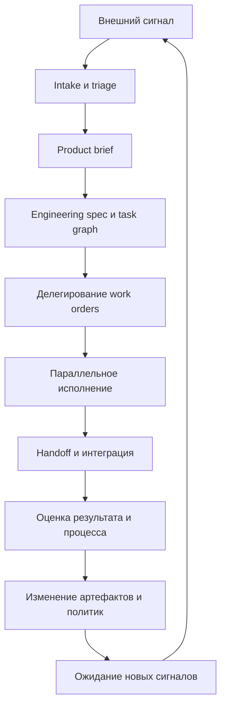

# Agent Organization Design

> Версия файла: `v1.0`
> Дата версии: `2026-03-16`
> Тип документа: `развёрнутая проектная спецификация`
> Основание:
> - [agent_organization.md](./agent_organization.md)
> - [agent_operating_system.md](./agent_operating_system.md)
> - текущий цикл обсуждений в этом репозитории
>

## Аннотация

Этот документ описывает уже не общую идею `Agent Organization`, а её **реальную проектную конструкцию**.

Его задача - ответить на вопросы:

- какие именно артефакты должны существовать в такой организации;
- зачем нужен каждый артефакт;
- кто его создаёт и использует;
- как артефакты взаимодействуют между собой;
- как выглядит полный цикл работы организации;
- почему такая система должна мыслиться не как одноразовый проект, а как **постоянно работающий цикл**.

Главная мысль документа:

**агентная организация возникает не из "набора умных агентов", а из правильно спроектированной системы артефактов, ролей, связей и циклов обновления.**

## Сначала не артефакты, а требования к конструкции

Любая структура должна вытекать из требований.

Если мы говорим о настоящей агентной организации, то она должна уметь:

1. принимать внешние сигналы и требования;
2. преобразовывать их в рабочие формулировки;
3. разбивать работу на этапы и параллельные ветки;
4. координировать исполнителей;
5. сохранять общий контекст и память;
6. интегрировать результаты;
7. оценивать качество результата и процесса;
8. учиться на своих ошибках и улучшать собственную архитектуру.

Из этих требований и вытекает конструкция артефактов.

## Организация как артефактная надстройка

Это фундаментальный принцип, который надо зафиксировать ещё раз.

Внизу может быть один и тот же агентный runtime, многократно запущенный в разных контекстах.

Но организацией эти параллельные инстансы становятся только тогда, когда между ними существует надстройка из:
- ролей;
- политик;
- общих файлов и журналов;
- статусов;
- контрактов;
- правил передачи работы;
- правил эскалации;
- контуров оценки;
- контуров самоизменения.

То есть в данном документе мы проектируем не "супермодель", а именно **внешнюю систему организации работы**.

## Общая логика конструкции

Если упростить, то конструкция такой организации всегда состоит из семи больших слоёв:

1. слой идентичности и рамок;
2. слой входящих сигналов;
3. слой продуктовой интерпретации;
4. слой инженерной декомпозиции;
5. слой исполнения и синхронизации;
6. слой оценки и контроля;
7. слой самообучения и эволюции.

У каждого слоя есть собственные артефакты.

## Рекомендуемая файловая структура

Ниже - не единственно возможная, но очень практичная структура.

```text
agent_org/
  charter/
    mission.md
    scope_and_boundaries.md
    role_map.md
    autonomy_model.md
  policies/
    escalation_policy.md
    risk_policy.md
    tool_and_access_policy.md
    quality_gates.md
  intake/
    external_signals.md
    demand_queue.md
    triage_rules.md
  product/
    product_brief_template.md
    active_product_briefs/
  engineering/
    engineering_spec_template.md
    task_graph.md
    contract_registry.md
    dependency_map.md
  execution/
    work_orders/
    status_board.md
    handoff_log.md
    integration_log.md
  knowledge/
    decision_log.md
    domain_glossary.md
    pattern_library.md
    failure_library.md
  evaluation/
    golden_tasks.md
    benchmark_results.md
    process_audits.md
    metric_dashboard.md
  evolution/
    improvement_backlog.md
    change_proposals.md
    approved_changes.md
```

Эта структура полезна тем, что сразу разделяет:
- что является постоянной рамкой;
- что является текущим входом;
- что является рабочим состоянием;
- что является памятью;
- что является механизмом самоулучшения.

## Внешний контрольный слой

Но практика показала, что одной внутренней структуры `agent_org/` недостаточно.

Когда runtime завершает этап, нужен ещё и **внешний координационный контур**, который не принадлежит самому runtime, а принадлежит наблюдателю или manager-слою.

Этот слой нужен для того, чтобы:

- принимать сигнал о завершении этапа;
- читать summary и evaluation;
- решать, что делать дальше;
- передавать runtime следующую директиву;
- фиксировать, что runtime эту директиву увидел.

Поэтому поверх внутренних артефактов организации полезно держать ещё и **внешний control plane**.

Минимальный вариант такого слоя состоит из трёх типов артефактов:

- `RUNTIME_STATUS.md` — сигнал от runtime к observer;
- `OBSERVER_DIRECTIVE.md` — команда от observer к runtime;
- `RUNTIME_ACK.md` — подтверждение от runtime обратно observer.

Это ещё не полный message bus, но уже рабочий примитивный коммуникационный слой.

## Слой 1. Идентичность и рамки организации

Этот слой нужен для того, чтобы организация знала, кто она, ради чего работает и в каких границах может действовать.

### `charter/mission.md`

Функция:
задаёт миссию организации и её верхнеуровневую цель.

Что должно быть внутри:
- зачем существует организация;
- для какого класса задач она создана;
- что считается успехом;
- что считается недопустимым поведением.

С чем взаимодействует:
этот артефакт читают практически все роли, потому что он задаёт общий смысл.

### `charter/scope_and_boundaries.md`

Функция:
фиксирует границы применимости.

Что должно быть внутри:
- что организация имеет право делать;
- что она не имеет права делать;
- где она обязана эскалировать;
- какие домены входят в зону её ответственности.

С чем взаимодействует:
с `risk_policy.md`, `escalation_policy.md` и всеми исполнительскими ролями.

### `charter/role_map.md`

Функция:
описывает, какие роли есть в организации.

Что должно быть внутри:
- список ролей;
- ответственность каждой роли;
- входы и выходы каждой роли;
- кто кому может делегировать;
- кто кому может эскалировать проблему.

С чем взаимодействует:
с `task_graph.md`, `status_board.md`, `handoff_log.md`.

### `charter/autonomy_model.md`

Функция:
описывает общий принцип автономности.

Что должно быть внутри:
- какие решения организация принимает сама;
- какие решения остаются за человеком;
- какие типы изменений допустимы без подтверждения;
- какие типы изменений требуют согласования.

С чем взаимодействует:
со всеми политиками и с learning-контуром.

## Слой 2. Политики управления

Если `charter` отвечает за смысл и рамки, то `policies` отвечают за режим поведения.

### `policies/escalation_policy.md`

Функция:
определяет, когда проблема поднимается выше.

Что должно быть внутри:
- список ситуаций, допускающих локальное решение;
- список ситуаций, которые обязательно эскалируются;
- допустимые адресаты эскалации;
- формат эскалационного сообщения.

### `policies/risk_policy.md`

Функция:
ограничивает рискованное поведение.

Что должно быть внутри:
- классы риска;
- допустимые действия по каждому классу;
- необратимые действия;
- действия, требующие двойной проверки.

### `policies/tool_and_access_policy.md`

Функция:
управляет инструментами и доступами.

Что должно быть внутри:
- какие инструменты существуют;
- какие роли чем могут пользоваться;
- что разрешено только через manager-слой;
- что разрешено только в read-only режиме.

### `policies/quality_gates.md`

Функция:
определяет обязательные точки проверки.

Что должно быть внутри:
- какие проверки обязательны до интеграции;
- какие проверки обязательны до релиза;
- какие артефакты должны существовать перед закрытием этапа.

## Слой 3. Входящие сигналы

Организация не должна жить только от одной заранее заданной задачи.

Она должна уметь постоянно получать внешний импульс.

### `intake/external_signals.md`

Функция:
фиксирует все входящие стимулы.

Что должно быть внутри:
- бизнес-запросы;
- пользовательские сигналы;
- баг-репорты;
- изменения внешней среды;
- новые данные и документы;
- результаты исследований;
- наблюдения о сбоях и деградации.

Почему это важно:
без этого организация живёт в вакууме и перестаёт быть адаптивной.

### `intake/demand_queue.md`

Функция:
держит очередь актуальных входящих требований.

Что должно быть внутри:
- краткое описание запроса;
- приоритет;
- источник сигнала;
- статус обработки;
- ссылка на соответствующий `product brief`.

### `intake/triage_rules.md`

Функция:
определяет, как сигнал превращается в работу.

Что должно быть внутри:
- правила приоритизации;
- критерии отбора;
- критерии отклонения;
- критерии перевода сигнала в продуктовую задачу;
- критерии перевода сигнала в learning-контур.

## Слой 4. Продуктовая интерпретация

Не каждый внешний стимул сразу становится инженерной задачей.

Сначала он должен быть превращён в осмысленную продуктовую формулировку.

### `product/product_brief_template.md`

Функция:
задаёт стандарт формы для продуктового описания.

Что должно быть внутри:
- цель;
- для кого делается;
- какой сценарий использования;
- какая ценность ожидается;
- какие ограничения важны;
- какой результат считается полезным.

### `product/active_product_briefs/`

Функция:
содержит активные продуктовые описания.

Почему это важно:
именно здесь сырые внешние требования превращаются в рабочий смысл для всей организации.

## Слой 5. Инженерная декомпозиция

После продукта нужен инженерный перевод.

### `engineering/engineering_spec_template.md`

Функция:
задаёт формат инженерной спецификации.

Что должно быть внутри:
- техническая постановка;
- ограничения;
- этапы;
- критерии завершения;
- критерии проверки;
- список зависимостей.

### `engineering/task_graph.md`

Функция:
описывает не просто список задач, а граф работ.

Что должно быть внутри:
- последовательные этапы;
- параллельные ветки;
- блокеры;
- точки синхронизации;
- ожидаемые handoff между ролями.

Это один из центральных артефактов всей конструкции.

### `engineering/contract_registry.md`

Функция:
хранит контракты между ветками и ролями.

Что должно быть внутри:
- интерфейсы;
- форматы данных;
- допустимые выходы;
- обязательные входы;
- правила совместимости.

### `engineering/dependency_map.md`

Функция:
делает зависимости явными.

Что должно быть внутри:
- что от чего зависит;
- какие работы можно делать независимо;
- какие изменения запускают каскад пересборки.

## Слой 6. Исполнение и синхронизация

Здесь организация уже работает как живая система.

### `execution/work_orders/`

Функция:
содержит конкретные задания для исполнительских ролей.

Что должно быть внутри каждого `work order`:
- цель локальной задачи;
- входные артефакты;
- допустимые действия;
- ожидаемые выходы;
- критерии handoff следующей роли.

### `execution/status_board.md`

Функция:
держит общее состояние всех веток.

Что должно быть внутри:
- текущий статус ветки;
- владелец этапа;
- блокеры;
- готовность к handoff;
- готовность к интеграции.

### `execution/handoff_log.md`

Функция:
фиксирует передачу работы между ролями.

Что должно быть внутри:
- кто передал;
- кому передал;
- какой артефакт передан;
- в каком статусе передан;
- какие риски и допущения сопровождали передачу.

### `execution/integration_log.md`

Функция:
фиксирует сборку частей в единый результат.

Что должно быть внутри:
- какие ветки были интегрированы;
- какие конфликты возникли;
- какие проверки пройдены;
- какие отклонения допущены;
- какой итоговый артефакт получен.

## Слой 7. Организационная память

Без памяти такая система не может быть устойчивой и не может развиваться.

### `knowledge/decision_log.md`

Функция:
хранит ключевые решения.

Что должно быть внутри:
- само решение;
- контекст решения;
- причины выбора;
- отвергнутые альтернативы;
- последствия.

### `knowledge/domain_glossary.md`

Функция:
синхронизирует терминологию.

Что должно быть внутри:
- ключевые термины;
- их значения;
- допустимые интерпретации;
- нежелательные двусмысленности.

### `knowledge/pattern_library.md`

Функция:
хранит повторяемые удачные паттерны.

Что должно быть внутри:
- типовая ситуация;
- рекомендуемое решение;
- ограничения применимости;
- связанные policies и quality gates.

### `knowledge/failure_library.md`

Функция:
хранит типовые провалы и причины.

Что должно быть внутри:
- описание сбоя;
- корневая причина;
- где именно произошёл разрыв;
- какой урок из этого извлечён;
- какое изменение предложено.

## Слой 8. Оценка и контроль

Если нет оценки, организация не знает, работает ли она вообще правильно.

### `evaluation/golden_tasks.md`

Функция:
держит набор эталонных контрольных задач.

Что должно быть внутри:
- описание golden task;
- ожидаемый правильный результат;
- ожидаемый допустимый процесс;
- допустимые отклонения;
- метрики оценки.

### `evaluation/benchmark_results.md`

Функция:
хранит результаты прогонов benchmark-контуров.

Что должно быть внутри:
- версия организации;
- версия policies;
- версия skills и runtime-конфигурации;
- результаты по каждой golden task;
- отклонения от ожидаемого результата;
- отклонения от ожидаемого процесса.

### `evaluation/process_audits.md`

Функция:
оценивает не только итог, но и путь.

Что должно быть внутри:
- качество декомпозиции;
- качество делегирования;
- качество синхронизации;
- число лишних эскалаций;
- число потерянных handoff;
- устойчивость к сбоям.

### `evaluation/metric_dashboard.md`

Функция:
сводит метрики организации в одну панель.

Что должно быть внутри:
- результативность;
- скорость;
- качество интеграции;
- частота ненужных эскалаций;
- частота конфликтов;
- стоимость прохождения цикла;
- динамика улучшений.

## Слой 9. Эволюция и самоизменение

На этом слое организация перестаёт быть просто исполняющей системой и становится саморазвивающейся.

### `evolution/improvement_backlog.md`

Функция:
держит список улучшений самой организации.

Что должно быть внутри:
- выявленный дефицит;
- предполагаемая причина;
- предлагаемое изменение;
- ожидаемый эффект;
- приоритет улучшения.

### `evolution/change_proposals.md`

Функция:
формализует предложения по изменению архитектуры.

Что должно быть внутри:
- что именно предлагается изменить;
- какие артефакты будут затронуты;
- какие метрики должны улучшиться;
- какой риск создаёт изменение;
- как будет проводиться валидация.

### `evolution/approved_changes.md`

Функция:
фиксирует уже принятые архитектурные изменения.

Что должно быть внутри:
- дата изменения;
- версия изменения;
- основание;
- подтверждённый эффект после benchmark-прогона.

## Как артефакты взаимодействуют друг с другом

Логика взаимодействия выглядит так:

1. внешний сигнал попадает в `external_signals.md`;
2. triage переводит его либо в `demand_queue.md`, либо в learning-контур;
3. продуктовый слой создаёт `product brief`;
4. manager-слой превращает его в `engineering spec` и обновляет `task_graph.md`;
5. по графу формируются `work orders`;
6. исполнители двигают `status_board.md` и оставляют записи в `handoff_log.md`;
7. интеграция собирается через `integration_log.md`;
8. evaluation-слой сравнивает результат с `golden_tasks.md` и записывает результаты в `benchmark_results.md` и `process_audits.md`;
9. learning-слой формирует предложения в `improvement_backlog.md` и `change_proposals.md`;
10. утверждённые изменения переходят в `approved_changes.md` и возвращаются в `charter`, `policies`, `knowledge` и другие постоянные артефакты.

Это и есть замкнутый цикл организации.

## Кто является владельцем артефактов

Это тоже нельзя оставлять неявным.

### Бизнес-спонсор

Отвечает за:
- миссию;
- верхнеуровневые границы;
- стратегические приоритеты;
- финальную эскалацию.

### Product-слой

Отвечает за:
- интерпретацию входящих сигналов;
- `product brief`;
- связь между бизнес-требованием и ценностью.

### Manager / Team Lead слой

Отвечает за:
- инженерную спецификацию;
- граф задач;
- контракты;
- зависимости;
- распределение работы;
- статусы;
- интеграцию;
- эскалацию внутри системы.

### Исполнительские роли

Отвечают за:
- локальные `work orders`;
- качество локального результата;
- корректный handoff;
- обновление связанных артефактов.

### Evaluation / Learning слой

Отвечает за:
- benchmark-контур;
- golden tasks;
- аудит процесса;
- метрики;
- backlog улучшений;
- предложения по изменению архитектуры.

## Почему эта система не является линейным проектом

Это особенно важно.

Обычный проект мыслят как линию:

`начало -> исполнение -> конец`

Но зрелая агентная организация работает иначе.

Она живёт как цикл:
- получает сигналы;
- перерабатывает их в работу;
- исполняет;
- оценивает;
- меняет себя;
- снова ждёт и обрабатывает новые сигналы.

Поэтому правильнее думать о ней не как о проекте, а как о **постоянно действующей операционной структуре**, которая:
- иногда выполняет внешние задачи;
- иногда перестраивает себя;
- всегда находится в состоянии потенциальной готовности к следующему циклу.

## Базовый цикл работы организации



## Самый важный вывод

Если сформулировать совсем жёстко, то проектирование агентной организации - это проектирование не "команды агентов", а **архитектуры артефактов, через которые один и тот же агентный субстрат превращается в коллективную систему труда**.

Именно качество этой артефактной конструкции определяет:
- будет ли система реальной организацией;
- сможет ли она работать долго;
- сможет ли она координировать параллельные ветки;
- сможет ли она учиться;
- сможет ли она безопасно повышать собственную агентность.

## Переход к следующему документу

Но как только конструкция спроектирована, возникает следующий вопрос:

**каким образом эта организация будет сама улучшать себя, откуда брать сигналы для обучения и как проверять, что улучшения действительно работают?**

Это подробно разбирается в [agent_organization_self_learning.md](./agent_organization_self_learning.md).

## Тезаурус

**Charter**  
Набор базовых документов, которые задают смысл, границы и роли организации.

**Intake**  
Контур приёма входящих сигналов, запросов и событий.

**Product brief**  
Документ, который переводит внешний запрос в продуктовый смысл.

**Engineering spec**  
Техническое описание того, как задача будет реализована.

**Task graph**  
Граф зависимостей между задачами, этапами и ветками работы.

**Work order**  
Локальное задание для конкретной роли или исполнителя.

**Handoff**  
Передача результата от одной роли другой.

**Integration**  
Сборка нескольких веток работы в единый итоговый результат.

**Process audit**  
Проверка не только результата, но и того, как именно система к нему пришла.

**Improvement backlog**  
Очередь улучшений, относящихся уже не к продукту, а к самой организации.
