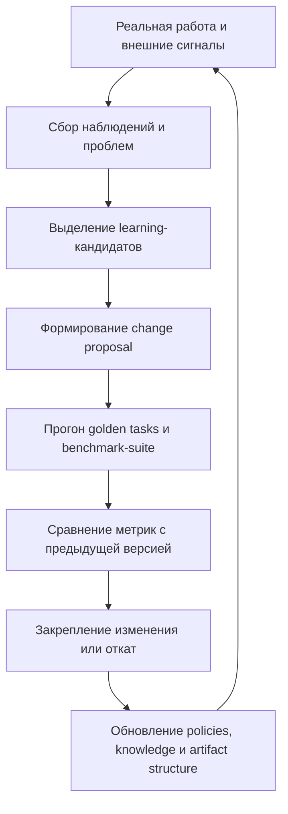

# Agent Organization Self-Learning

> Версия файла: `v1.0`
> Дата версии: `2026-03-16`
> Тип документа: `развёрнутая методология самообучения`
> Основание:
> - [agent_organization.md](./agent_organization.md)
> - [agent_organization_design.md](./agent_organization_design.md)
> - текущий цикл обсуждений в этом репозитории
>

## Аннотация

Этот документ описывает то качество, без которого агентная организация остаётся просто автоматизированной схемой.

Это качество:

**самообучение**

Речь идёт не о дообучении самой языковой модели и не о тренировке весов.

Речь идёт о другом:

**организация должна уметь наблюдать собственную работу, собирать внешние сигналы, прогонять контрольные задачи, измерять свои метрики, выявлять слабые места и изменять собственные артефакты, policies, маршруты и способы работы.**

Только тогда она становится не просто автономной, а **саморазвивающейся**.

## Почему самообучение здесь является главным качеством

Если организация умеет только исполнять заранее заданные задачи, то она остаётся статичной.

А среда, в которой она живёт, не статична:
- меняются требования;
- меняются технологии;
- меняются внешние сервисы;
- появляются новые типы ошибок;
- старые политики начинают устаревать;
- одни и те же схемы делегирования перестают работать одинаково хорошо;
- появляются новые возможности ускорения и автоматизации.

Поэтому зрелая агентная организация должна иметь внутренний цикл:

**выполнять работу -> оценивать себя -> изменять себя -> проверять изменение -> закреплять новое состояние**

Без этого она со временем деградирует.

## Что здесь считается самообучением

Важно сразу снять возможную путаницу.

В этом документе под самообучением понимается изменение не весов модели, а **организационного слоя**.

То есть организация учится через изменение:
- артефактов;
- policies;
- quality gates;
- правил делегирования;
- правил эскалации;
- шаблонов `product brief` и `engineering spec`;
- benchmark-корпуса;
- libraries знаний;
- состава ролей;
- состава skills и subagents;
- маршрутов работы.

Именно это и делает самообучение практически управляемым.

## У организации всегда есть два цикла

Это один из ключевых тезисов.

### 1. Внешний операционный цикл

Он отвечает на внешние стимулы:
- новые задачи;
- баги;
- запросы;
- изменения среды;
- внешние источники данных;
- сигналы от пользователей или бизнеса.

Его задача - выполнять полезную работу.

### 2. Внутренний цикл развития

Он работает всегда, даже если прямо сейчас нет срочной внешней задачи.

Его задача:
- наблюдать за результатами;
- обнаруживать слабые места;
- прогонять контрольные задачи;
- проверять устойчивость организации;
- вносить улучшения;
- измерять, стало ли лучше.

Именно этот цикл делает систему не разовым процессом, а постоянно развивающейся структурой.

## Откуда организация получает материал для самообучения

Источников должно быть несколько.

### 1. Реальные рабочие проходы

Каждая реальная задача даёт материал:
- где произошли блокеры;
- где была лишняя эскалация;
- где потерялся контекст;
- где сломался handoff;
- где интеграция прошла плохо;
- где какая-то роль не справилась.

### 2. Внешние данные и изменения среды

Сюда входят:
- изменения документации;
- изменения API и инструментов;
- изменения внешних сервисов;
- новые best practices;
- новые риски;
- новые типы входящих требований.

### 3. Golden tasks

Это специально подобранные контрольные задачи с заранее известным правильным результатом и, по возможности, с ожидаемой структурой правильного процесса.

Они нужны не для бизнеса напрямую, а для проверки самой организации.

### 4. Failure cases

Организация должна учиться не только на успехах, но и на провалах.

Именно failure cases особенно полезны для:
- изменения policies;
- усиления quality gates;
- исправления маршрутов handoff;
- уточнения роли manager-слоя;
- обновления libraries знаний.

## Почему одной golden task недостаточно

Идея "одной тестовой задачи" очень полезна как первый шаг.

Но зрелая система почти всегда быстро приходит к необходимости **набора** golden tasks.

Причина проста:

одна задача может проверить один тип поведения, но не проверит всю организацию.

Поэтому со временем нужен минимум такой набор:

1. простая детерминированная задача;
2. многоэтапная задача;
3. задача с параллельными ветками;
4. задача с конфликтом зависимостей;
5. задача с обязательной эскалацией;
6. задача с поиском внешней информации;
7. задача на восстановление после сбоя;
8. длинная задача на удержание контекста.

То есть практический путь такой:

- сначала одна canonical golden task;
- потом небольшой benchmark-suite;
- потом полноценный regression-корпус организационного уровня.

## Что именно должна проверять golden task

Нужно проверять не только "правильный ли финальный ответ".

Golden task должна позволять измерять два разных измерения.

### 1. Результат

Проверяется:
- получен ли правильный артефакт;
- совпадает ли он с ожидаемым результатом;
- соблюдены ли обязательные ограничения;
- не появились ли недопустимые побочные эффекты.

### 2. Процесс

Проверяется:
- правильно ли была выполнена декомпозиция;
- были ли созданы нужные артефакты;
- были ли правильными handoff;
- были ли лишние эскалации;
- не было ли потери зависимости между ветками;
- не было ли лишних циклов;
- правильно ли отработали quality gates.

Именно проверка процесса делает benchmark действительно организационным.

## Базовые артефакты learning-контура

Чтобы самообучение не было абстракцией, ему тоже нужны собственные артефакты.

### `evaluation/golden_tasks.md`

Содержит:
- список golden tasks;
- описание каждого сценария;
- ожидаемый результат;
- ожидаемые процессные признаки;
- критерии провала и успеха.

### `evaluation/benchmark_results.md`

Содержит:
- дату прогона;
- версию организации;
- версию policies;
- версию skills и runtime-настроек;
- результат по каждой golden task;
- обнаруженные отклонения.

### `evaluation/process_audits.md`

Содержит:
- анализ процесса;
- точки разрыва;
- причины лишних эскалаций;
- качество делегирования;
- качество интеграции;
- устойчивость к непредсказуемости.

### `evolution/improvement_backlog.md`

Содержит:
- список наблюдаемых дефицитов;
- предполагаемые причины;
- приоритет исправления;
- ожидаемую метрику улучшения.

### `evolution/change_proposals.md`

Содержит:
- конкретное предложение изменения;
- какой артефакт меняется;
- как именно он меняется;
- какую проблему это должно исправить;
- чем это будет проверено.

### `evolution/approved_changes.md`

Содержит:
- какие изменения приняты;
- почему они приняты;
- на каком benchmark-контуре они доказали улучшение;
- не вызвали ли они регрессию в других сценариях.

## Главный принцип: учиться нужно не вслепую, а через controlled change

Самообучение не должно означать хаотическое самопереписывание.

Иначе система очень быстро начнёт:
- ломать собственные policies;
- переоптимизироваться под частный benchmark;
- ухудшать реальные рабочие проходы;
- вносить сразу слишком много изменений;
- терять управляемость.

Поэтому зрелое самообучение должно идти так:

1. зафиксировать проблему;
2. локализовать источник проблемы;
3. предложить ограниченное изменение;
4. прогнать benchmark;
5. сравнить метрики;
6. проверить на регрессии;
7. только после этого закрепить изменение.

То есть здесь нужен не "свободный рост", а **управляемая эволюция**.

## Базовый контур самообучения

В минимально зрелом виде он выглядит так:

## Как локализовать причину проблемы

Это один из самых важных этапов.

Если проблема найдена, нужно понять, где именно она живёт.

Она может находиться:
- в неправильной роли;
- в неудачном handoff;
- в плохом контракте;
- в слабом quality gate;
- в неправильной декомпозиции;
- в недостаточном skill;
- в неверной политике доступа;
- в отсутствии нужного артефакта;
- в переусложнённой коммуникации;
- в ошибочной логике эскалации.

То есть объектом улучшения почти всегда является **не сама модель**, а элемент организационной конструкции.

## Как выглядит правильная метрика самообучения

Если главная метрика `Agent Organization` - это организационная агентность, то здесь нужна ещё более точная метрика:

**скорость и качество улучшения организационной агентности без потери управляемости**

Или в более практическом виде:

**насколько быстро система становится лучше в прохождении сложных задач, не становясь при этом более хаотичной или более опасной.**

## Какие метрики надо держать обязательно

Минимальный набор должен включать:

1. качество финального результата;
2. качество процесса;
3. число лишних эскалаций;
4. число потерянных handoff;
5. число конфликтов между ветками;
6. долю успешных интеграций;
7. устойчивость к длинным задачам;
8. устойчивость к неожиданным изменениям;
9. стоимость прохождения benchmark;
10. дельту улучшения между версиями организации.

Последняя метрика особенно важна.

Она показывает, обучается ли система вообще или просто крутится в цикле без реального прогресса.

## Что именно организация должна менять в ходе самообучения

Очень важно понимать, что объектом изменения может быть не только prompt.

Организация может менять:
- policies;
- quality gates;
- templates;
- правила triage;
- способы декомпозиции;
- правила handoff;
- правила интеграции;
- состав benchmark-suite;
- libraries знаний;
- роль manager-слоя;
- набор skills;
- набор subagents;
- карту доступов;
- структуру артефактов.

То есть самообучение здесь охватывает весь организационный уровень.

## Когда надо эскалировать даже learning-изменение

Не каждое самоизменение должно проходить полностью автономно.

Эскалация нужна, если:
- изменение затрагивает базовую миссию;
- изменение меняет границы допустимого риска;
- изменение может открыть опасные действия;
- benchmark не даёт однозначного результата;
- улучшение в одном месте создаёт серьёзную регрессию в другом;
- изменение затрагивает бизнес-приоритеты, а не только внутреннюю механику.

То есть даже самообучающаяся система остаётся **управляемой**, а не бесконтрольной.

## Главный риск: reward hacking организационного уровня

Это надо назвать прямо.

Самообучающаяся организация может начать оптимизироваться не под реальную полезность, а под удобные ей самой сигналы.

Например:
- слишком хорошо подгоняться под одну golden task;
- учиться красиво заполнять артефакты, но не улучшать реальную работу;
- снижать число эскалаций ценой скрытых ошибок;
- ускоряться за счёт пропуска важных quality gates;
- "улучшать метрики" без улучшения смысла.

Поэтому benchmark всегда должен проверять:
- реальный результат;
- реальный процесс;
- устойчивость;
- отсутствие регрессии в соседних сценариях.

## Почему организация должна уметь жить в режиме ожидания

Вы правильно указали ещё один важный момент:

такая организация не всегда занята одной активной внешней задачей.

Часто она будет находиться в состоянии:
- наблюдения;
- ожидания новых стимулов;
- мониторинга внешней среды;
- сбора сигналов;
- пополнения benchmark-корпуса;
- анализа прошлых ошибок;
- внутреннего улучшения.

То есть состояние "между проектами" для неё не является пустотой.

Это и есть время внутреннего обучения.

## Самая короткая формула

Если сформулировать предельно коротко, то так:

**зрелая агентная организация не просто работает.  
Она постоянно измеряет себя, проверяет себя и перестраивает себя.**

Именно это превращает её из автоматизированной схемы в **саморазвивающуюся систему**.

## Переход к следующему практическому шагу

После этого логичный следующий шаг уже совсем прикладной:

**выбрать первую canonical golden task, описать ожидаемый правильный результат и ожидаемый правильный процесс, а затем начать прогонять эту задачу через конкретную архитектуру организации.**

С этого момента методология превращается в инженерный эксперимент.

## Тезаурус

**Golden task**  
Контрольная задача с заранее известным правильным результатом и ожидаемым процессом.

**Benchmark-suite**  
Набор контрольных задач, который используется для проверки версий организации.

**Controlled change**  
Ограниченное управляемое изменение, которое проходит через явную валидацию.

**Regression**  
Ухудшение в одном сценарии после улучшения в другом.

**Reward hacking**  
Ситуация, когда система улучшает формальные метрики, но не реальную полезность.

**Organizational self-learning**  
Способность организации менять собственные артефакты, policies и маршруты работы на основе наблюдений, benchmark-прогонов и накопленного опыта.
